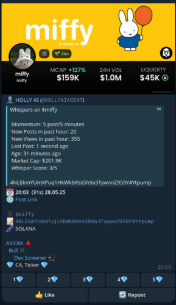

# raw-bot-X

A Telegram-based account and post manager for X, primarily developed for monitoring and interacting with memecoin-related content. Built entirely using Claude 3.7 Sonnet and Gemini 2.5 Pro Preview (05-06).

> ⚠️ **WARNING:** Use this bot at your own risk. Some actions violate X's Terms of Service and could result in suspending your account or even take legal action. Always test with new or disposable accounts.
> Also keep in mind, that it's very likely that there will be posts which should be triggered but won't be. This might be because of bad code, a bug or something else. If you expect important news but miss it 
> because of bugs, don't rely just on this. 
>
>Info about X: It has limits
>https://help.x.com/en/rules-and-policies/x-limits
>**Direct Messages:** 500 per day.
>**Posts:** 2,400 per day (divided into smaller, half-hourly sub-limits; Reposts count as Posts).
>**Account Email Changes:** 4 per hour.
>**Following (daily):** 400 per day (this is a technical limit; be aware of additional rules against aggressive following).
>**Following (account-based):** Once an account follows 5,000 other accounts, further follow attempts are subject to account-specific quotas.
>*   These limits may be temporarily reduced during periods of high site usage. Updates will be posted on the X Status site.
>
>**What happens if you hit a limit?**
>*   You will see an error message indicating the specific limit.
>*   For time-based limits (e.g., DMs, Posts, account email changes, API requests), you can try again after the limit period has passed.
>*   If you hit the daily post limit (which is divided into half-hourly sub-limits), please try again in a few hours once the sub-limit period has passed.
>
>You can see your stats by typing /stats
>Those were mine at some point
>
>`🔎 Scanned Posts:
>Today: 290 posts
>Yesterday: 4715 posts
>Day before yesterday: 5850 posts
>Total: 135995 posts`
>
>The script is a little buggy, messy and all the code is in one main file because it was never meant to get this big. But overall it works nicely. It does what it should do.
>I also couldn't test it with a larger screen resolution than 1080p. This may lead to different results in some functions (e.g. backup, followscraping, ..) as mentioned.

## Preview



### First of all
With your newly created account. (Without the use of your telephone number, you can create a new email address on proton) You have to follow accounts to get their posts. Just like in real life. 

## Supported Platforms

- Linux (Debian/Ubuntu)
- Windows (tested only win11 on a Virtual Machine)
- Raspberry Pi (no installation guide available yet. Running on Pi 4, 2GB, with Pi OS Lite + LXQt (long-term, headless mode is recommended))
Had a lot of problems with Raspi Lite OS, no Wifi connection. Have to figure it out again to make an installation guide.

## Features

### Login
- Automatic login using email/password/username and cookies.(`config.env`)
- Authentication codes can be sent via Telegram.
- Automatic account switch on failure (not fully tested).
- Supports long-term usage with automated Selenium driver restarts to free up RAM. 

### Post Scanning
Scans your timeline for:
- Custom keywords
- Contract addresses
- Ticker symbols

**Scan modes** (combinable):
- Ticker
- Contract address
- Keywords

Sends results to your Telegram group with:
- Post images (only 1 is shown in telegram)
- Post time & time since posting
- Direct link to the post
- Post text (only till (show more) button)
- Ticker & CA copy text
- Quick links: BullX, Rugcheck, Dexscreener, Pumpfun, Solscan, gmgn
- Basic Account ratings (top 3 rated accounts shown)
- Filter to only show hits when rating is above 3.5
- Like & repost buttons
- Scan trigger info (e.g., triggered keywords/CA/ticker)

### Add Followers
- Add via Telegram commands: `/follow [username]`, `/unfollow [username]`
- Restore from backups
- Sync from side accounts (global follow list)
- Scan follow list from another user account (only ~50 Accounts showing): `/scrapefollowing [username]`
- Stores scraped users (with follower count, bio) in Database
- Add from Database to followlist using filters:
  - `/addfromdb followers:5000 seen:2 keywords:ape, degenCEO,facebook` (seen=how often this account has been seen in scanned accounts)
  - `/addfromdb followers:30k keywords:meme`
  - `/addfromdb followers:1M`

### Auto Follow
- Slow mode: follows users at intervals (adjustable)
- Fast mode: immediate list execution (fast means not "fast", it's very slow ~2-3 acc/min but in future will give the opportunity to do it over night like schedule. Faster would just look like suspicious.)
- Toggle modes on/off

### Schedule
- Pause/resume bot at defined times
- `/schedule 22:00-12:00`
- Schedule of syncing the global userlist
- Schedule processing of the follow list

### Statistics
- Uptime
- Posts found (today & total)
- Posts scanned (today & total)
- Total ads found (not working at moment)
- Average posts by weekday

### Headless Mode
- Runs browser in background (Selenium), recommended for slow PI
- Some features disabled in this mode
- Toggle on/off

### Keywords
- Add single or comma-separated list via:
  - `/addkeyword keyword1, keyword2, keyword3`


**Installation time: approximately 15 minutes to 1 hour** 

[Jump to Linux Installation](#installation-linux-start)
[Jump to Windows Installation](#installation-windows-start)
[Jump to Raspberry Pi Installation](#installation-rpi-start)


## Installation Linux START

### 1. Choose a target folder and navigate into it
```bash
mkdir -p ~/rawbotx  # or any path you prefer
cd ~/rawbotx
```

### 2. Install git
```bash
sudo apt update && sudo apt install git
```

### 3. Clone the repository
```bash
git clone https://github.com/rawBotX/raw-bot-X.git
cd raw-bot-X

Or download the zip file and extract it in your preferred folder 
```

### 4. Create a venv (optional but recommended)
It will install everything just in this virtual environment.

```bash
sudo apt install python3.12-venv
python3 -m venv xvenv
```

Activate this environment
```bash
source xvenv/bin/activate
```

Your path will now look like this
`(xvenv) user:~/rawbotx/raw-bot-X$`

Just for your information, you can deactivate it with the code below. But for now, keep it active.
```bash
deactivate
```

### 5. Download Chrome + ChromeDriver (Linux)
Download both from:  
https://googlechromelabs.github.io/chrome-for-testing/#stable

- Download **Chrome** for **Linux64**
- Download **ChromeDriver** for **Linux64** both need to be the **exact same version**
- Extract both into the bot folder:
```
~/rawbotx/raw-bot-X/Chrome-linux64
~/rawbotx/raw-bot-X/Chromedriver-linux64
```

### 6. Install Dependencies
```bash
pip install --upgrade pip
pip install -r requirements.txt
```

[Click for next step -> Chrome](#configuration)

## Installation Linux END


## Installation Windows START

### 1. Install Python
Download and install latest windows installer 64-bit Release (Python 3.10 or higher) from: 
https://www.python.org/downloads/windows/

>**Important:** At start of the installation, check “Add Python to PATH”.

After install, open **CMD** (Windows key → type `cmd`) and verify:
```bash
python --version
```

### 2. Create a target folder and navigate into it
```bash
mkdir C:\rawbotx  # or any path you prefer
cd C:\rawbotx
```

Choose 3a or 3b
ℹ️ Updating with Git is easier: Use the included `Update.bat` in the bot folder for one-click updates.

### 3a. Clone Repository using Git (recommended for updates)
Download Git for Windows: 
https://git-scm.com/downloads/win

Select Components -> Next

Choose your favorite text editor as default editor if you're not familiar with other editors
Let Git decide
Adjust your PATH environment -> Recommended -> Next
Use bundled OpenSSH -> Next
native -> Next
Windows-style -> Next
MinTTY -> Next
Fast-forward or merge -> Next
Git Credential Manager -> Next
Enable file caching -> Next
--installation--
You can open Git bash or close the installation and use the windows cmd (search -> type cmd).

Then:
```bash
cd c:\rawbotx
git clone https://github.com/rawBotX/raw-bot-X.git
cd raw-bot-X
```
ℹ️ Updating: Use the included `Update.bat` in the bot folder for one-click updates.

### 3b. Or install manually via ZIP
- Download the ZIP file from the repo
- Extract it into your folder, e.g.:  
  `C:\rawbotx\raw-bot-X`
- Then navigate into it:
```bash
cd C:\rawbotx\raw-bot-X
```
ℹ️ Updating without git:
Check https://github.com/rawBotX/raw-bot-X for newer versions. 
Download the zip file. Extract into your bot folder. 
Start

### 4. Install Python dependencies
```bash
python.exe -m pip install --upgrade pip
pip install -r requirements.txt
```

### 5. Download Chrome + ChromeDriver (Win64)
Download both from:  
https://googlechromelabs.github.io/chrome-for-testing/

- Download **Chrome** for **Win64**
- Download **ChromeDriver** for **Win64** both need to be the **exact same version**
- Extract both into the bot folder:
```
C:\rawbotx\raw-bot-X\Chrome-win64
C:\rawbotx\raw-bot-X\Chromedriver-win64
```

[Click for next step -> Configuration](#configuration)

## Installation Windows END


## Installation Raspberry Pi START

⚠️ For better performance, stop autoplay videos, and if you notice any problems, try also to lower the post image quality. 
On X, left panel go to -> ... More -> Settings and privacy -> Accessibility, display, and languages 
-> Data usage -> Autoplay -> never (Autostart Video deactivated)
-> Datasaver ✅ (lower image quality)
[Click for next step -> Configuration](#configuration)

## Installation Raspberry Pi END


## Configuration

### Create a file in the bot directory:
`Linux` - create the file **config.env** and put the code down below inside or rename the downloaded file config.env.example.
`Windows` - you first have to ensure that your file extension is showing. Otherwise your file would be named config.env.txt rather than config.env.

**Windows Only - file extension**
Open the File Explorer

## Windows 11: 
Click "View" in the top menu bar: At the very top of the File Explorer window, you'll see words like "File", "Home", "Share", and "View". Click on View.
Go to "Show": A dropdown menu will appear. Hover your mouse over (or click) Show.
Check "File name extensions" to add a checkmark and you'll immediately see extensions on your files.
## Windows 10: 
Open File Explorer: Click the folder icon on your taskbar or press Windows key + E.
Click the "View" tab: At the top of the File Explorer window, you'll see a "ribbon" with tabs like "File", "Home", "Share", and "View". Click on the View tab.
Check "File name extensions": In the "Show/hide" section of the ribbon, you'll see a checkbox labeled File name extensions. Click this box to put a checkmark in it. You'll immediately see extensions on your files.

Now create the file **config.env** and put the code down below inside or rename the downloaded file config.env.example.

Set your YourBotToken, YourBotUsername, YourTelegramChannelID, YourAdminUserID, email, password, and username, and save the file.

### How to get Telegram credentials:
- `BOT_TOKEN` & `: Get from [@BotFather](https://t.me/botfather)` -> `/newbot`
- `BOT_USERNAME`: Set a name, has no function yet. Telegram uses the Botfather name.
- `CHANNEL_ID`: Add [@Phanes_bot](https://t.me/Phanes) to your group/channel -> type `/id` Group/Channel ID will be YourTelegramChannelID
- `ADMIN_USER_ID`: Search for `@userinfobot` -> open a chat with it -> click `/start` down below. The ID will be YourAdminUserID
>Admin ID is important, only admins can interact with the bot.

- `ACCOUNT_1_USERNAME`: The account username, is your X account username (e.g., @yourhandle), entered here without the '@' symbol.

The cookie file will be created the first time you log in. You can leave the name as it is.
`ACCOUNT_1_COOKIES=x_0.cookies.json` 

```ini
# Bot Configuration
BOT_TOKEN=YourBotToken
BOT_USERNAME=SetABotUsername
CHANNEL_ID=YourTelegramChannelID

BOT_TEST_TOKEN=Possible2ndBotTokenOptional
BOT_TEST_USERNAME=SetATestBotUsernameOptional

# Admin (mandatory for bot interaction)
ADMIN_USER_ID=YourAdminUserID

# X Account 1
ACCOUNT_1_EMAIL=web3@mail.net
ACCOUNT_1_PASSWORD=yourPassword1
ACCOUNT_1_USERNAME=account1username
ACCOUNT_1_COOKIES=x_0.cookies.json

# X Account 2
ACCOUNT_2_EMAIL=trench@mail.net
ACCOUNT_2_PASSWORD=yourPassword2
ACCOUNT_2_USERNAME=account2username
ACCOUNT_2_COOKIES=x_1.cookies.json

# Add more accounts as needed...
```


### Optional: Telegram Bot Commands (via BotFather)
If you want your bot to offer built-in command suggestions in Telegram (autocomplete), you can set them via @BotFather:

Open BotFather Channel in Telegram

Select your bot → Edit Bot → Edit Commands

Paste the following command list:
```bash
help - Show help menu and command list
ping - Check if the bot is responding
stats - Show post statistics (alias: /count)
status - Show current operational status
account - Show active account info
keywords - Show current keywords
schedule - Show current main bot pause schedule status
allschedules - Show status of all schedules (Main, Sync, Follow List)
rates - Show collected source ratings and Top 3
globallistinfo - Show status of the global follower list
autofollowstatus - Show auto-follow status for current account
listadmins - List current bot admins
pause - Pause post searching and other activities
resume - Resume post searching and other activities
searchtickers - Toggle searching for $Tickers ON/OFF
setmaxage - Set max post age for processing (e.g., /setmaxage 30)
toggleheadless - Toggle headless mode ON/OFF (requires WebDriver restart)
setminavgrating - Set min average rating filter for posts (e.g., /setminavgrating 3.5)
toggleshowunrated - Toggle showing posts from unrated users ON/OFF
togglelink - Show/configure CA link display settings
scheduleon - Activate the main bot pause schedule
scheduleoff - Deactivate the main bot pause schedule
scheduletime - Set main bot pause schedule (e.g., /scheduletime 22:00-08:00)
schedulesync - Toggle scheduled sync ON/OFF
schedulesynctime - Set time window for scheduled sync (e.g., /schedulesynctime 03:00-03:30)
schedulefollowlist - Toggle scheduled follow list processing ON/OFF
schedulefollowlisttime - Set time window for scheduled follow list (e.g., /schedulefollowlisttime 04:00-04:30)
addkeyword - Add keywords (e.g., /addkeyword btc,eth)
removekeyword - Remove keywords (e.g., /removekeyword sol)
follow - Follow a user (e.g., /follow elonmusk)
unfollow - Unfollow a user (e.g., /unfollow vitalikbuterin)
addusers - Add users to current account's follow list (e.g., /addusers user1 @user2)
autofollowmode - Set auto-follow mode (off|slow|fast)
autofollowinterval - Set slow auto-follow interval (e.g., /autofollowinterval 10-20 minutes)
cancelfastfollow - Cancel running Fast-Follow task
clearfollowlist - Clear current account's follow list (asks confirmation)
like - Like a post by URL (e.g., /like <tweet_url>)
repost - Repost a post by URL (e.g., /repost <tweet_url>)
switchaccount - Switch X account (e.g. /switchaccount 2 or /switchaccount for next)
backupfollowers - Backup current account's 'following' list
syncfollows - Sync current account's 'following' with global list (asks confirmation)
buildglobalfrombackups - Update global list from all account backups (asks confirmation)
initglobalfrombackup - Overwrite global list from one account's backup (e.g., /initglobalfrombackup 1)
cancelbackup - Cancel ongoing follower backup process
cancelsync - Cancel ongoing follower sync process
scrapefollowing - Scan 'following' of user(s) to DB (e.g. /scrapefollowing user1 user2)
addfromdb - Add users from DB to follow list (e.g., /addfromdb f:10k s:2 k:dev)
canceldbscrape - Cancel ongoing database scrape process
addadmin - Add a bot admin (e.g., /addadmin 123456789 @userinfobot)
removeadmin - Remove a bot admin (e.g., /removeadmin 987654321)
```


## Start the bot once (creating needed files)
`admins.json, keywords.json, add_contacts_user.txt, follower_backup_user.txt, following_database.json, global_followed_users.txt, posts_count.json, ratings.json, schedule.json, settings.json, x_0.cookies.json`

### Linux
Open your Terminal and navigate to the root directory of your bot
```bash
cd ~/rawbotx/raw-bot-X
```
Then start the script with python or python3
```bash
python3 main.py
```

>The bot will login automatically with your name and password

### Windows
Open cmd and navigate to the root directory of your bot
```bash
cd C:\rawbotx\raw-bot-X
```
Then start the script with python or python3
```bash
python main.py
```

>The bot will login automatically with your name and password


## Next step is optional safety measures for encryption and file permission. If you don't want this, you are done and can take a look at [Updating](#aaaaaand-you-are-done) Otherwise go to the next step.


## Stop the script 
After a successful login, stop the script (Ctrl+C) in Terminal or cmd. There is still something to do.


## Encrypt the config.env file (optional, but recommended). With encryption, you will need to enter a password at startup; without encryption, no password is required.
For the safety of your data (Bot api, passwords...), encrypt the file. After encryption it will be config.env.gpg
>You don't want any scammer to use your bot or X account!

### Linux
Open Terminal
```bash
sudo apt install gpg
gpg --symmetric --cipher-algo AES256 config.env
sudo rm config.env
```
Set a password, you need this for starting the script.

### Windows
Install https://gpg4win.org/ in C:\Program Files (x86)
Open CMD (press Win key-> type cmd)
We have to register it
```bash
set PATH=%PATH%;C:\Program Files (x86)\GnuPG\bin
```
Go to your bot directory
```bash
cd C:\rawbotx\raw-bot-X
```
Encrypt and delete the unencrypted file!
```bash
gpg --symmetric --cipher-algo AES256 config.env
del config.env
```
Set a password you can remember, you need this for starting the script.


## Decrypt Config.env.gpg
>Just in order you want to change your config file.

Open your Terminal or cmd

**Linux**
cd ~/rawbotx/raw-bot-X
**Windows**
cd C:\rawbotx\raw-bot-X

```bash
gpg --output config.env --decrypt config.env.gpg
```

Type in your password. 
`If you have saved it in your systems password manager or the GPG agent still has it cached from recent use, you may not be prompted to enter it again.`
You can now open your config.env
After you've finished your edit, encrypt it again.


## File Permission (optional, but recommended)
Now set permissions for the files you've created
Navigate in your file explorer to the bot's root folder. Inside it, you'll find a folder named `utils`. Copy the permission script (linux_set_bot_permissions.sh for Linux or win_set_bot_permissions.bat for Windows) from the utils folder into the bot's root folder.

### Linux
```bash
cd ~/rawbotx/raw-bot-X
chmod +x linux_set_bot_permissions.sh
./linux_set_bot_permissions.sh
```

### Windows
Right click on win_set_bot_permissions.bat -> open as Administrator


## Aaaaaand you are done

### Start on Linux

Without virtual environment (xvenv)
```bash
cd ~/rawbotx/raw-bot-X
python3 main.py
```
With virtual environment
```bash
cd ~/rawbotx/raw-bot-X
source xvenv/bin/activate
python3 main.py
```


Type in your given config password. Now it should start running.

As you see the start screen in your Telegram channel, the bot is paused. 
Click the bottom button `Show Help`  and press `PAUSED`
You see now the browser window is scrolling and the Terminal gives you infos about whats going on.
Add keywords in the Telegram menu, take a look around and set it as you like.
`/help` will show the menu

Good luck & have fun!

### Start on Windows
```bash
cd C:\rawbotx\raw-bot-X
python main.py
```

Type in your given config password. Now it should start running.

As you see the bot start screen in your Telegram channel, the bot is paused. 
Click the bottom button `Show Help`  and press `PAUSED`
You see now the browser window is scrolling and the Terminal gives you infos about whats going on.
Add keywords in the Telegram menu, take a look around and set it as you like.
`/help` will show the menu

Good luck & have fun!

## Backup User from your Main Account 

If you want to track users from your main account. You can make a backup of all your follows without saving your personal account data in the config file. 
>⚠️ **WARNING:** Keep in mind, scraping can lead to an account suspension or ban at any time.
Start the bot as follow

Linux
```bash
cd ~/rawbotx/raw-bot-X
python3 main.py login_manual_session
```

Windows
```bash
cd C:\rawbotx\raw-bot-X
python main.py login_manual_session
``` 

Now you can login by yourself. 
In your Telegram bot channel, type
```bash
/confirmlogin
```

Follow the bot's further instructions.

It should be something like this
```bash
/backupfollowers
```

And then 
```bash
/buildglobalfrombackups
```

Stop the bot and login normally with your account setup from the config file.

To follow the users from the list you just generated, you can decide between

**Turn on AF Mode fast**: it will now just follow ~60-80 users/h and while it's following it will not scan for posts. 
**Turn on AF Mode slow**: here you can set an interval how often someone from the global follow list should be followed. While the bot now scans your posts, it also follows users in an irregular time. 
**Set Schedule Sync**: especially for night times, but remember the limits. 
>**Following (daily):** 400 per day (this is a technical limit; be aware of additional rules against aggressive following).


## Updating

### With git
`It will pull the latest update from git.`

### Linux
Go to the bot folder

```bash
cd ~/rawbotx/raw-bot-X/utils
```

Copy&paste the linux_update.sh into the bot directory
```bash
chmod +x linux_update.sh
./linux_update.sh
```

Now you can always run the update by 
```bash
cd ~/rawbotx/raw-bot-X
./linux_update.sh
```

### Windows
Go to the bot folder

```bash
cd C:\rawbotx\raw-bot-X\utils

```

Copy&paste the win_update.bat into the bot directory and double-click it


### Without git
Download the latest update manually and extract it in your bot root dir.


## Explanation of the functions

The command you need to know is `/help`
Help shows you all of the commands and buttons

🆘 /help - Show menu 🆘
 
🚶‍♂️‍➡️    Follow / Unfollow    🚶‍♂️
   /follow username
   /unfollow username
   /addusers @user1 user2 ... 
      └ Adds to follow list.
`There is a follow list; all names on this list are processed when auto follow (slow/fast) or scheduled follow is enabled.`

   /autofollowmode off|slow|fast
   /autofollowinterval 3-8 - interval in minutes (Slow Mode)
   /cancelfastfollow
   /autofollowstatus
   /clearfollowlist
  
👍    Like / Repost    🔄
   /like tweet_url
   /repost tweet_url
  
🔑    Keywords    🔑
`These keywords are searched in all posts shown on your timeline. If one is found, you receive the post.`

   /keywords  - Shows list
   /addkeyword word1,word2...
   /removekeyword word1,word2...
  
🥷    Accounts    🥷
`It’s possible to have multiple accounts you can switch between. It’s also possible to run a second bot with a second account.
For example:
Test represents the 2nd bot, "2" represents the account number
python or python3 main.py test 2
would run a second bot using the second account details from the config.env:
BOT_TEST_TOKEN=
BOT_USERNAME=
CHANNEL_ID=`

   /account  - Show active account
   /switchaccount 1 
      └ Switches to acc [nmbr]
  
🔍    Search Mode    🔍
`It should rather be called tracking mode.
Full — is outdated, it should be called Keyword Mode. Posts are searched for all your keywords, sent to you, and show which keywords were found.
CA — a post that contains a contract address will be sent to you.
Ticker — a post with a ticker? That post goes straight into your Telegram channel.`

   /mode  - current search mode
   /modefull  - Sets mode to CA + Keywords
   /modeca  - Sets mode to CA Only
   /searchtickers
      └ scan for $Tickers on|off
   /setmaxage 3
      └ Sets max post age(in minutes) (default: 15)
`Posts older than this age will not be processed.`
  
🔗    CA Link configuration    🔗
   /togglelink - opens link display
`Setting the links in a CA post. e.g. Axiom, BullX,...
If interested, I can expand it to include more links or let you add custom links yourself.`
  
⏯️    Control    ⏯️
   /pause
   /resume
  
🗓️    All Schedules    🗓️
   /allschedules - Shows status of all schedules

   ▫️ Main Bot Pause Schedule:
     /schedule  - current main schedule
     /scheduleon | /scheduleoff
     /scheduletime 01:30-08:30

   ▫️ Scheduled Sync:
     /schedulesync on|off
     /schedulesynctime 01:30-03:30
`There is a global user list where the names of all accounts can be stored.
This list can be synchronized — all users your account doesn’t follow yet will then be followed.
It’s a time-consuming system to follow users, so it’s best to follow large amounts during a set time, e.g., at night or when you’re away.
Don’t draw attention and avoid exceeding the allowed follow limits.`

   ▫️ Scheduled Follow List:
     /schedulefollowlist on|off
     /schedulefollowlisttime 01:31-02:15
`It processes your follow list in fast mode at a specific time.`
  
📊    Statistics & Status    📊
   /status
`Shows whats going on, Schedules on/off, times, how many users are on the follower list.`
   /stats
   /rates  - collected ratings
   /globallistinfo  - global follower list
   /ping  - test
  
💾  Following DB & Management  💾
   /scrapefollowing username
         └ Scans following of [username] & saves to DB
`For example /scrapefollowing elonmusk, the accounts he is following will be saved in a database, including how many followers they have, their bio and how often they were found by /scrapefollowing on other users.
Info: unfortunately, only about 50 follows are shown on the following page of a user.`

   /addfromdb f:50k s:3 k:WORD1, WORD2, ...
         └ Adds from DB. Filters:
           f[ollowers]: Min. follower count (e.g., f:10k or followers:10000)
           s[een]: Min. times seen in scans (e.g., s:3)
           k[eywords]: Keywords in bio (e.g., k:btc, eth or keywords:solana, nft)
`Here you can select from the database using minimum follower count, keywords from the bio, or how often this person has already been found in a previous **scrapefollowing**.
These filtered users are then added to your follow list.`

   /backupfollowers  - Saves snapshot of the active account
   /syncfollows  - Synchronizes active account with global list
   /buildglobalfrombackups 
         └ Adds users from all backups to the global list
`Important with multiple accounts:
Create a backup for each account and add it to the global list.
This way, all users from all accounts are collected into the global list.`

   /cancelbackup ,  /cancelsync ,  /canceldbscrape 
         └ Cancels running processes
  
   /toggleheadless 
         └ Toggles Headless mode ON/OFF (Autom. Browser restart!)
`Recommended for very weak machines like the Raspberry Pi,
or if it should run in the background while you’re working on it.`


## Version

Current version: **v0.2.0**

See all releases and changelogs here: [Releases](https://github.com/rawBotX/raw-bot-X/releases)


## License

This project is open source under the MIT License:

```text
MIT License

Copyright (c) 2025 rawBotX

Permission is hereby granted, free of charge, to any person obtaining a copy
of this software and associated documentation files (the "Software"), to deal
in the Software without restriction, including without limitation the rights
to use, copy, modify, merge, publish, distribute, sublicense, and/or sell
copies of the Software, and to permit persons to whom the Software is
furnished to do so, subject to the following conditions:
...
```

Full license text is in [LICENSE](LICENSE)


## Used Libraries & Licenses

This project uses the following open-source Python libraries:

| Library                | License Type             | License URL                                                                 |
|------------------------|--------------------------|-----------------------------------------------------------------------------|
| selenium               | Apache License 2.0       | https://www.apache.org/licenses/LICENSE-2.0                                 |
| python-telegram-bot    | LGPLv3                   | https://www.gnu.org/licenses/lgpl-3.0.html                                  |
| python-dotenv          | BSD License              | https://opensource.org/licenses/BSD-3-Clause                                |
| nest-asyncio           | MIT License              | https://opensource.org/licenses/MIT                                         |
| requests               | Apache License 2.0       | https://www.apache.org/licenses/LICENSE-2.0                                 |
| pytz                   | MIT License              | https://opensource.org/licenses/MIT                                         |
| beautifulsoup4         | MIT License              | https://opensource.org/licenses/MIT                                         |

**Note on LGPLv3:**  
The library `python-telegram-bot` is used as-is and not modified.  
LGPLv3 allows usage in open or closed source projects as long as the library remains replaceable and dynamically linked.  
For details: https://www.gnu.org/licenses/lgpl-3.0.html


**Disclaimer:**  
This project was generated entirely with the help of AI tools (Claude 3.7 Sonnet & Gemini 2.5 Pro).  
It is provided "as-is" under the MIT license. Users may modify and distribute it at their own risk.


## Contributing

Pull requests are welcome. 


## Contact

For questions, suggestions or issues, open a GitHub Issue or send me an email rawbotx@proton.me


